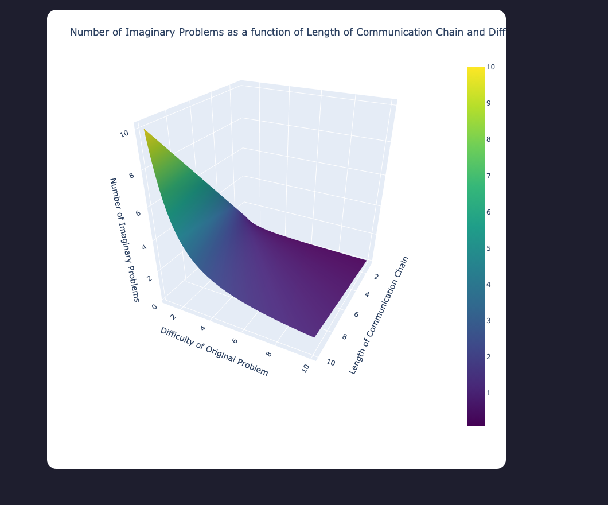

# Rounded Images

A [Digital Garden](https://github.com/oleeskild/digitalgarden) plugin that
rounds the corners of images.



## Settings

| Setting | Default | Description |
| --- | --- | --- |
| Corner radius (px) | `8` | How rounded the image corners should be, in pixels. |
| Which images | `content` | `content` rounds only images inside note content; `all` rounds every image on the site. |

Settings can also be set via environment variables in the garden's `.env`:
`ROUNDED_IMAGES_RADIUS` and `ROUNDED_IMAGES_SCOPE`.

## Per-note opt-out

Rounding is on for every note while the plugin is enabled. Disable it
for a single note by adding this to its frontmatter:

```yaml
dg-no-rounded-images: true
```

## Install

Paste this repo's URL into the plugin installer of your garden, or copy
the plugin directory into `src/plugins/rounded-images/` manually.
