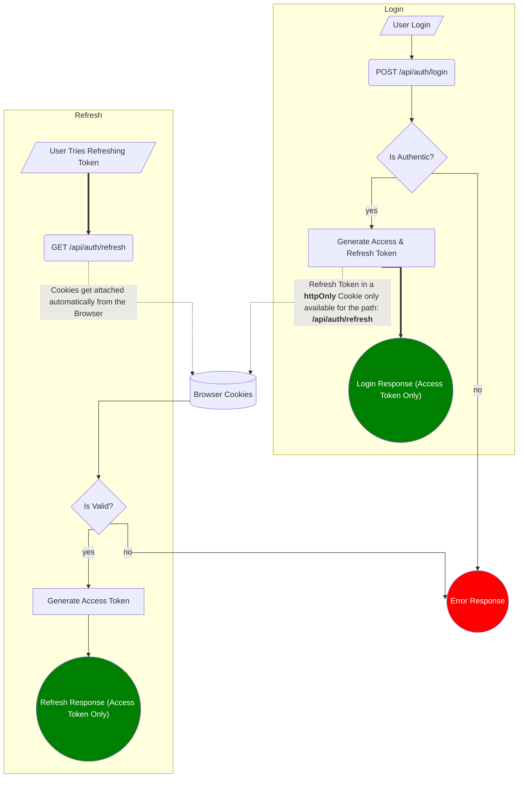

---
{"title":"How to integrate Saleor JWT in Nuxt 3","aliases":["How to integrate Saleor JWT in Nuxt 3"],"created":"2024-04-29T10:26:43+06:00","updated":"2026-06-10T19:51:39+06:00","dg-publish":true,"dg-note-icon":"chest","tags":["technical","how-to","nuxt3","nuxt","apollo","graphql","saleor","jwt","django"],"dg-path":"Writings/Technical/HowTos/How to integrate Saleor JWT in Nuxt 3.md","permalink":"/writings/technical/how-tos/how-to-integrate-saleor-jwt-in-nuxt-3/","dgPassFrontmatter":true,"noteIcon":"chest","dg-note-properties":{"title":"How to integrate Saleor JWT in Nuxt 3","aliases":["How to integrate Saleor JWT in Nuxt 3"],"created":"2024-04-29T10:26:43+06:00","updated":"2026-06-10T19:51:39+06:00","tags":["technical","how-to","nuxt3","nuxt","apollo","graphql","saleor","jwt","django"]}}
---

[Saleor](https://saleor.io) uses [JWT Authentication](https://docs.saleor.io/docs/3.x/api-usage/authentication), which is very easy to integrate in Nuxt. Call the login API, get the token, and call the `onLogin` in [NuxtApollo](https://apollo.nuxtjs.org/recipes/authentication). Straightforward, isn't it?

The real challenge is to secure the Refresh Token. Ideally, Refresh Tokens are sensitive and **should be stored in secure HTTP cookies**; they shouldn't be transported to the frontend JavaScript at all.

## Implementation



### Login
We will start by implementing the login. The flow is roughly like this:

1. A user will attempt to log in with their credentials, but not directly to Saleor. The request will be made to `/api/auth/login`.
2. Our server's API handler will request on our behalf from Saleor's API.
3. Then it will **strip the `refreshToken` from the response** and return the Access Token and the `additionalData` to the user.

```javascript
// server/api/auth/login.js

import { jwtDecode } from "jwt-decode";

const loginQuery = `
  mutation tokenCreate(
    $email: String
    $password: String!
  ) {
    tokenCreate(
      email: $email
      password: $password
    ) {
      token
      refreshToken
      <additionalFields>
      errors {
        message
        code
      }
    }
  }
`;

export default defineEventHandler(async (event) => {
  const body = await readBody(event);
  const { email, password, additionalFields } = body;

  if (!email) {
    throw createError({
      statusCode: 400,
      statusMessage: "Email is required",
      data: {
        errors: [
          {
            message: "Email is required",
            code: "MISSING_FIELD",
          },
        ],
      },
    });
  }
  if (!password) {
    throw createError({
      statusCode: 400,
      statusMessage: "Password is required",
      data: {
        errors: [
          {
            message: "Password is required",
            code: "MISSING_FIELD",
          },
        ],
      },
    });
  }

  const query = loginQuery.replace(
    "<additionalFields>",
    additionalFields ? additionalFields : ""
  );
  const config = useRuntimeConfig(event);
  const { data } = await $fetch(config.public.ecomApi, {
    method: "POST",
    body: {
      query,
      variables: { email, password },
    },
  });
  const { token, refreshToken, errors, ...additionalData } = data?.tokenCreate;
  const responseData = { ...additionalData, token, errors };
  if (data.tokenCreate?.token && data.tokenCreate?.refreshToken) {
    setCookie(event, "refreshToken", refreshToken, {
      httpOnly: true,
      secure: true,
      path: "/api/auth",
      expires: new Date(jwtDecode(refreshToken).exp * 1000),
    });
    return { data: responseData };
  } else {
    const error = responseData.errors[0].code;
    let code = 400;
    if (error === "INVALID_CREDENTIALS") {
      code = 401;
    } else if (error === "ACCOUNT_NOT_CONFIRMED") {
      code = 407;
    }
    throw createError({
      statusCode: code,
      data: responseData,
    });
  }
});

```

The support for supplying the `additionalFields` parameter allows the user to get the user profile in one go with the tokens.

Note that we have set the `path` for the cookie to `/api/auth`. This will make the cookie accessible only to `/api/auth` routes. We have also set the expiry time to automatically expire the `refreshToken`.

From the frontend, the login request may look like this:

```javascript
const USER_FIELDS = 'user { id email firstName lastName isActive isConfirmed metafields(keys: ["gender"])';

const { onLogin } = useApollo();
const payload = {
  email: "someemail@somedomain.com",
  password: "averyhardpassword",
  additionalFields: USER_FIELDS,
};
try {
  const { data } = await $fetch("/api/auth/login", {
    method: "POST",
    headers: {
      "Content-Type": "application/json",
    },
    body: JSON.stringify(payload),
  });
  onLogin(data.token);
} catch (error) {
  // ...handle errors
}

```

### Refresh
The refresh flow is quite similar to the login flow. In this case, we're only getting the optional `additionalFields`. Then we get the `refreshToken` from the cookie and request a new `accessToken` from the Saleor's API.

```javascript
// server/api/auth/refresh.js

const refreshQuery = `
    mutation RefreshToken($refreshToken: String) {
        tokenRefresh(refreshToken: $refreshToken) {
            token
            <additionalFields>
            errors {
                message
                code
            }
        }
    }
`;

export default defineEventHandler(async (event) => {
  const body = await readBody(event);
  const config = useRuntimeConfig(event);
  const cookies = parseCookies(event);
  const refreshToken = cookies.refreshToken;
  if (!refreshToken) {
    throw createError({
      statusCode: 400,
      statusMessage: "Refresh expired",
      data: {
        errors: [
          {
            message: "Refresh expired",
            code: "REFRESH_EXPIRED",
          },
        ],
      },
    });
  }
  const query = refreshQuery.replace(
    "<additionalFields>",
    body.additionalFields ? body.additionalFields : ""
  );

  const { data } = await $fetch(config.public.ecomApi, {
    method: "POST",
    body: {
      query,
      variables: { refreshToken },
    },
  });
  if (!data.tokenRefresh?.token) {
    setCookie(event, "refreshToken", "", {
      maxAge: 0,
      httpOnly: true,
      secure: true,
      path: "/api/auth",
    });
    return { data };
  }
  throw createError({
    statusCode: 400,
    data,
  });
});

```

### Logout
Since Saleor doesn't provide a `logout` Mutation, we're just deleting the `refreshToken` from the cookies.

```javascript
// server/api/auth/logout.js

export default defineEventHandler(async (event) => {
  setCookie(event, "refreshToken", "", {
    maxAge: 0,
    httpOnly: true,
    secure: true,
    path: "/api/auth",
  });
  return { status: true };
});
```

## Conclusion
I tried finding a proper way to handle `refreshToken` in Nuxt 3's authentication flow, but the solutions found are unsatisfactory. Eventually, I came up with it while working on a project. The theory is general enough to be implemented for any JWT authentication flow regardless of the backend used.